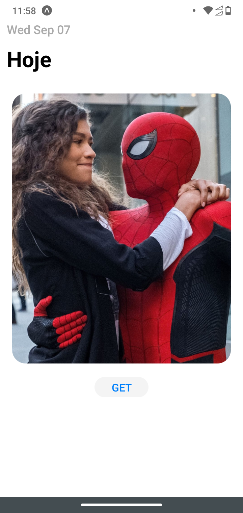

# ButtomSheet

Exemplo de uso de buttom sheet em react native com expo.

#### tecnologias usadas:

- typescript
- react-native-reanimated,
- react-native-gesture-handler,
- react-native-status-bar-height,

---

## Screenshot

  
  
  

---
